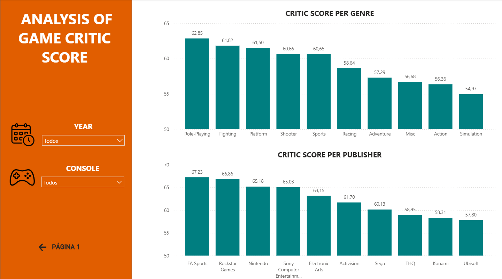

# 🎮 Análise de Vendas e Avaliações de Videogames


## 📊 Sobre o projeto

Este projeto foi desenvolvido utilizando Power BI para analisar dados
de vendas e avaliações de videogames.

A análise busca identificar padrões de vendas ao longo dos anos,
avaliar o desempenho dos diferentes gêneros e analisar as avaliações
críticas dos jogos por gênero e empresa.

## 🎯 Objetivos

- Analisar a evolução das vendas ao longo dos anos;
- Identificar os gêneros com maior volume de vendas;
- Identificar os jogos com maior volume de vendas;
- Analisar a média das notas críticas por gênero;
- Analisar as notas críticas por empresa;
- Permitir análises utilizando filtros de ano, gênero e console.

## 📂 Fonte dos dados

Os dados utilizados neste projeto foram obtidos através do dataset
[Video Game Sales 2024](https://www.kaggle.com/datasets/asaniczka/video-game-sales-2024?resource=download), disponibilizado no Kaggle.

A base foi utilizada em formato CSV e importada para o Power BI
utilizando a vírgula como delimitador.

## 🛠️ Ferramentas utilizadas

- Power BI
- Power Query
- DAX
- Kaggle
- CSV

## 🔄 Tratamento dos dados

Foram realizados tratamentos básicos na base de dados antes da
construção do dashboard.

Entre os tratamentos realizados estão:

- Alteração dos tipos de dados;
- Padronização da capitalização de algumas colunas;
- Configuração do delimitador da base CSV;
- Preparação dos dados para utilização no Power BI.

## 🧮 Medida DAX

Para calcular a média das notas críticas, foi criada uma medida
que considera apenas os jogos que possuem uma avaliação crítica
preenchida.

```DAX
Nota Média =
AVERAGEX(
    FILTER(
        'vgchartz-2024',
        NOT(ISBLANK('vgchartz-2024'[critic_score]))
    ),
    'vgchartz-2024'[critic_score]
)
```

## 📈 Página de Vendas


A primeira página apresenta a análise do desempenho comercial dos jogos, permitindo filtrar os resultados por ano, gênero e console.
São apresentados gráficos de evolução das vendas ao longo dos anos, vendas por gênero e vendas por jogo.

## ⭐ Página de Avaliação Crítica



A segunda página apresenta a análise das avaliações críticas dos jogos, permitindo filtrar os resultados por ano e console.
A página apresenta a média das notas críticas por gênero e as notas críticas por empresa.

## 🔎 Principais insights

Concentração por gênero
Sports (107.690), Action (103.436) e Shooter (92.530) dominam as vendas, juntos representam bem mais da metade do total entre os 9 gêneros listados. Os três últimos colocados (Fighting, Adventure, Simulation) somam menos que o líder sozinho.

Call of Duty domina o ranking de títulos
Das 10 maiores vendas individuais, 5 são jogos da franquia Call of Duty (Black Ops, MW3, Ghosts, Black Ops 3, MW2, Advanced Warfare), evidência de força de franquia recorrente, não só de lançamentos isolados. GTA V lidera com folga (6.429), mais que o dobro do segundo colocado. Minecraft (2.401) é o único fora do padrão "ação/tiro/mundo aberto" no top 10.

Descompasso entre venda e qualidade percebida
Aqui está o insight mais interessante do relatório: os gêneros mais vendidos não são os mais bem avaliados pela crítica.

- Role-Playing tem a melhor nota (62,85) mas é o 6º gênero em vendas.
- Action, o 2º mais vendido, tem uma das piores notas (56,36).
- Sports, líder em vendas, fica no meio da tabela de notas (60,65).

Isso sugere que popularidade comercial nesse mercado é puxada mais por franquias fortes e jogabilidade "casual/mainstream" do que por reconhecimento crítico.

Publishers "de nicho" bem avaliados x publishers de volume
EA Sports (67,23) e Rockstar Games (66,86) lideram em nota — faz sentido, já que Rockstar é dona da franquia GTA, líder de vendas. Nintendo (65,18) e Sony (65,03) também aparecem bem posicionadas, refletindo sua reputação de exclusivos de alta qualidade. Já publishers como Ubisoft (57,80) e Konami (58,31) fecham a lista, o que pode indicar produção mais massificada/menos consistente.

## 📚 Aprendizados

O desenvolvimento deste projeto contribuiu para o aprimoramento
dos conhecimentos em:

- Construção de dashboards no Power BI;
- Tratamento de dados utilizando Power Query;
- Criação de medidas utilizando DAX;
- Utilização de filtros e segmentações de dados;
- Construção de indicadores;
- Visualização e análise de dados.
